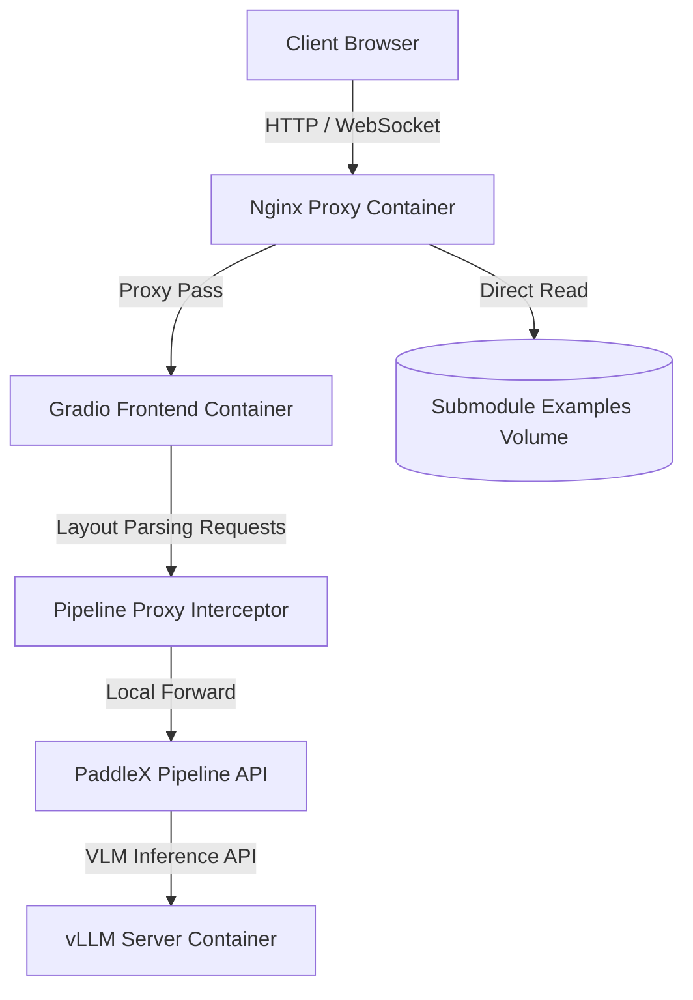

# System Architecture Document

This document outlines the multi-container deployment architecture of the PaddleOCR VL 1.6 Online Demo.

## Overview

The application is deployed using a multi-container GPU-accelerated architecture to serve the web UI, process layout/document parsing, and perform high-speed VLM inference via vLLM.

## System Components

### 1. Reverse Proxy (Nginx)
- **Role**: Front-facing web server listening on the port configured in `.env`.
- **Purpose**:
  - Handles client requests and routes them to the Gradio frontend.
  - Serves static example images directly from the local volume mount, bypassing the Python backend to resolve path mismatches.
  - Handles WebSocket upgrades needed for Gradio's server-sent events / real-time updates.

### 2. Gradio Frontend (`paddle-ocr-demo`)
- **Role**: Python application running the Gradio interface.
- **Purpose**:
  - Coordinates user inputs, uploads, and visualizes document parsing outputs.
  - Offloads model logic to the `pipeline-api` container via HTTP requests.

### 3. Layout Pipeline (`pipeline-api`)
- **Role**: Backend GPU service running the PaddleX pipeline framework.
- **Internal Components**:
  - **Pipeline Proxy Interceptor**: A FastAPI proxy ([pipeline_proxy.py](../scripts/pipeline_proxy.py)) listening on port `8090` that intercepts all parsing response payloads, detects raw base64 image data, prepends the correct `data:image/jpeg;base64,` (or png) schema, and returns the browser-renderable Data URLs.
  - **PaddleX Core Service**: The real PaddleX serving engine running internally on port `8091`. Processes layout detection (via PP-DocLayoutV3), text orientation classification (via PP-LCNet), and image unwarping (via UVDoc).
  - Delegates the text recognition and conditional generation tasks to the `vllm-server`.

### 4. VLM Inference Server (`vllm-server`)
- **Role**: Model server running vLLM engine.
- **Purpose**:
  - Performs high-speed inference for the PaddleOCR-VL-1.6-0.9B Vision-Language Model.
  - Accelerates output throughput using optimized batching and KV caching.

## Directory Layout

- [docker-compose.yml](../docker-compose.yml): Services orchestration.
- [Dockerfile](../Dockerfile): Backend build script.
- [nginx.conf](../nginx.conf): Routing configuration.
